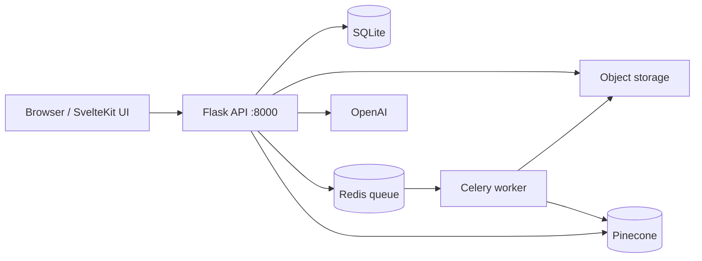

# PDF Chat

A full-stack RAG app: upload a PDF, then ask questions against that document.

The UI is a SvelteKit SPA. Flask serves the API and the built client. Celery + Redis handle embedding jobs off the request path so uploads stay responsive. Vectors are meant to live in Pinecone; generation goes through LangChain + OpenAI. Langfuse is wired for scoring which model / retriever / memory combo actually works.

This repo is a personal learning build: the product shell (auth, documents, viewer, chat UI, worker) is in place. The RAG core lives in `app/chat/` — that is the layer you plug a real chain into.

## Features

- Email/password auth and per-user document lists
- PDF upload with a browser viewer (PDF.js)
- Conversations tied to a single document
- Streaming-ready chat API (`text/event-stream`)
- Background document processing via Celery
- Score dashboard hooks for comparing RAG components

## Architecture



| Piece | Role |
| --- | --- |
| `client/` | SvelteKit + Tailwind UI (static build served by Flask) |
| `app/web/` | Flask API, sessions, SQLAlchemy models |
| `app/celery/` | Worker process |
| `app/chat/` | RAG: embeddings, chain, Langfuse scores |
| Redis | Celery broker — **software you run locally**, not a required cloud account |
| File storage | HTTP upload/download service (`UPLOAD_URL`). PDFs are not stored in SQLite. |

Three processes must run together: **Flask**, **the worker**, and **Redis**. Stop any one of them and uploads or background jobs will fail.

## Tech stack

**Backend:** Python 3.11, Flask, SQLAlchemy, Celery, Redis, LangChain, OpenAI, Pinecone, Langfuse  
**Frontend:** SvelteKit, TypeScript, Tailwind CSS, PDF.js  
**Tooling:** Pipenv (recommended), Invoke (`inv dev` / `inv devworker`)

## Quick start

### Prerequisites

- Python **3.11**
- [Pipenv](https://pipenv.pypa.io/)
- Redis — native `redis-server` on macOS/Linux, or **Docker** on Windows
- Node.js only if you change the Svelte UI (`client/` already has a production build)

### 1. Clone and install

```bash
cd pdf
pipenv install --python 3.11
```

`pipenv install` creates the virtualenv. Activate it with `pipenv shell`, or prefix commands with `pipenv run`.

### 2. Environment

Copy the keys below into a `.env` in the project root (that file is gitignored).

```env
SECRET_KEY=change-me
SQLALCHEMY_DATABASE_URI=sqlite:///sqlite.db
UPLOAD_URL=https://your-upload-host.example

REDIS_URI=redis://localhost:6379

OPENAI_API_KEY=
PINECONE_API_KEY=
PINECONE_ENV_NAME=
PINECONE_INDEX_NAME=
LANGFUSE_PUBLIC_KEY=
LANGFUSE_SECRET_KEY=
```

| Variable | Required to boot | Notes |
| --- | --- | --- |
| `SECRET_KEY` | yes | Flask sessions |
| `SQLALCHEMY_DATABASE_URI` | yes | Local SQLite is fine for development |
| `UPLOAD_URL` | yes | Base URL of the file API (`POST /upload`, `GET /download/<id>`) |
| `REDIS_URI` | for the worker | e.g. `redis://localhost:6379` |
| OpenAI / Pinecone / Langfuse | for RAG | Leave empty until you implement `app/chat/` |

On some Windows machines port **6379 is reserved**. If Docker cannot bind it, publish another host port and set `REDIS_URI` to match (for example `redis://localhost:16379` with `-p 127.0.0.1:16379:6379`).

### 3. Database

```bash
pipenv run flask --app app.web init-db
```

This **drops and recreates** tables. Use it for first setup or a full reset, not on a database you care about.

### 4. Redis

macOS / Linux:

```bash
redis-server
```

Windows (Docker):

```bash
docker run -d --name redis -p 6379:6379 redis:7
# if 6379 is blocked:
docker run -d --name redis -p 127.0.0.1:16379:6379 redis:7
```

Later: `docker start redis`.

### 5. API and worker

Two terminals, project root, venv active:

```bash
inv dev          # Flask → http://127.0.0.1:8000
inv devworker    # Celery, auto-reload on app/*.py
```

Without `pipenv shell`:

```bash
pipenv run inv dev
pipenv run inv devworker
```

Open [http://127.0.0.1:8000](http://127.0.0.1:8000), sign up, and upload a PDF.

Until `build_chat` in `app/chat/chat.py` returns a chain, the chat API responds with `Chat not yet implemented!` — that is expected.

## Frontend

Flask serves `client/build`. To change the UI:

```bash
cd client
npm install
npm run dev      # Vite, proxies /api → :8000
npm run build    # write a new static build for Flask
```

## Project layout

```
app/
  chat/          RAG chain, embeddings, scoring
  celery/        worker entrypoint
  web/           Flask app, views, models, file client
client/          SvelteKit source + static build
tasks.py         inv dev / inv devworker
Pipfile          Python 3.11 lock-in
```

## Alternative: venv

```bash
python -m venv .venv
# macOS / Linux
source .venv/bin/activate
# Windows
.\.venv\Scripts\activate

pip install -r requirements.txt
flask --app app.web init-db
inv dev
inv devworker
```

`requirements.txt` tracks the same pins as the Pipfile (Pipfile may include a couple of extra packages such as `langchain-community`).

## Production notes

- Do not use Flask’s debug server. Run a WSGI server and a separate worker.
- SQLite and local disk will not survive typical PaaS deploys. Use Postgres and object storage (S3, R2, or a small upload API).
- Redis in production is still Redis — a managed instance, not a different product.
- `UPLOAD_URL` is an HTTP file locker, not a database URI.

## License

Private / personal project. Add a license before you make the repository public if you want others to reuse it.
